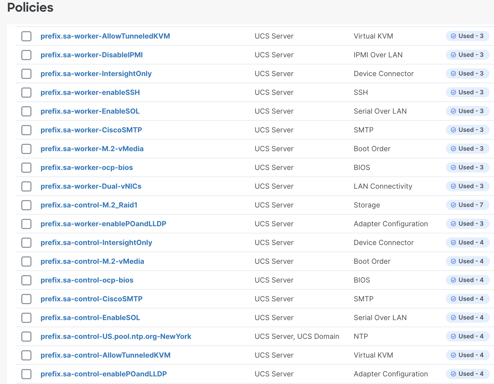

# Intersight Configuration for Red Hat OpenShift

Configuration files to deploy pools, policies and profiles required to configure Intersight and prepare servers for Red Hat OpenShift.

isctl is a kubectl-insipired CLI for the Cisco Intersight service.

https://github.com/cgascoig/isctl/tree/devel

brew install cgascoig/isctl/isctl

https://github.com/cgascoig/isctl/releases/tag/v0.2.7

DEVICES SHOULD BE CLAIMED IN INTERSIGHT

Follow the Quick Start guide to claim Fabric Interconnects:
https://www.cisco.com/c/en/us/products/collateral/servers-unified-computing/ucs-x-series-modular-system/ucs-x-series-quick-start-guide.html

YOU MUST EDIT ALL YAML FILES TO MATCH YOUR ENVIRONMENT

** Using isctl **

Run isctl configure to configure it to use your API key. Follow the prompts for your key ID and path to the key file.

StandAlone Servers:

```
 isctl apply -f 1_allPolicies.yaml
 isctl apply -f 2_serverProfileTemplate.control.yaml
 isctl apply -f 3_serverProfileTemplate.worker.yaml
 isctl apply -f 4_deriveProfiles.yaml

```

FIAttached Servers:

```
  
cd 1_domain_profile/
 isctl apply -f 1_vlanpolicy.yaml
 isctl apply -f 2_portpolicy.yaml
 isctl apply -f 3_switchpolicies.yaml
 isctl apply -f 4_domain_profile.yaml

```
```
 
cd 2_chassis_profile/
 isctl apply 1_pools.yaml
 isctl apply 2_policies.yaml
 isctl apply 3_chassis_profile.yaml
 
```
```

cd 3_server_profiles/
 isctl apply 1_UUID_Pool.yaml
 isctl apply 2_policies.yaml
 isctl apply 3_serverProfileTemplate.yaml
 isctl apply 4_server_profiles.yaml

```




  