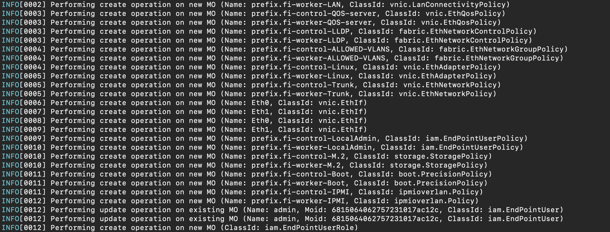

# Intersight Configuration Templates

Configuration templates for deploying pools, policies and profiles using isctl.

isctl is a kubectl-insipired CLI for the Cisco Intersight service.

https://github.com/cgascoig/isctl/tree/devel

brew install cgascoig/isctl/isctl

https://github.com/cgascoig/isctl/releases/tag/v0.2.7

DEVICES MUST BE CLAIMED IN INTERSIGHT

Follow the Quick Start guide to claim Fabric Interconnects:

https://www.cisco.com/c/en/us/products/collateral/servers-unified-computing/ucs-x-series-modular-system/ucs-x-series-quick-start-guide.html

YOU MUST EDIT THE RENDER SCRIPT VARIABLES AND RENDER YAML FILES FOR YOUR ENVIRONMENT

```

isctl configure                       
intersight_api_key_id is currently '<yourAPIkey>'
Enter new intersight_api_key_id or press Enter to keep existing: 
intersight_secret_key is currently '<location>/<file>'
Enter new key file name or press Enter to keep existing: 
intersight_fqdn is currently 'us-east-1.intersight.com'
Enter new Intersight FQDN or press Enter to keep existing: 
INFO[0023] Writing config file  

```

StandAlone Servers:

```
 python3 ./renderStandalone.py  
 isctl apply -f 1_allPolicies.yaml
 isctl apply -f 2_serverProfileTemplate.control.yaml
 isctl apply -f 3_serverProfileTemplate.worker.yaml
 isctl apply -f 4_deriveProfiles.yaml

```

FIAttached Servers:

```
  
cd 1_domain_profile/
 python3 ./renderDomain.py
 isctl apply -f 1_vlanpolicy.yaml
 isctl apply -f 2_portpolicy.yaml
 isctl apply -f 3_switchpolicies.yaml
 isctl apply -f 4_domain_profile.yaml

```
```
 
cd 2_chassis_profile/
 Python3 ./renderChassis.py
 isctl apply -f 1_pools.yaml
 isctl apply -f 2_policies.yaml
 isctl apply -f 3_chassis_profile.yaml
 
```
```

cd 3_server_profiles/
 Python3 ./renderServer.py
 isctl apply -f 1_UUID_Pool.yaml
 isctl apply -f 2_policies.yaml
 isctl apply -f 3_serverProfileTemplate.yaml
 isctl apply -f 4_server_profiles.yaml

```




  
